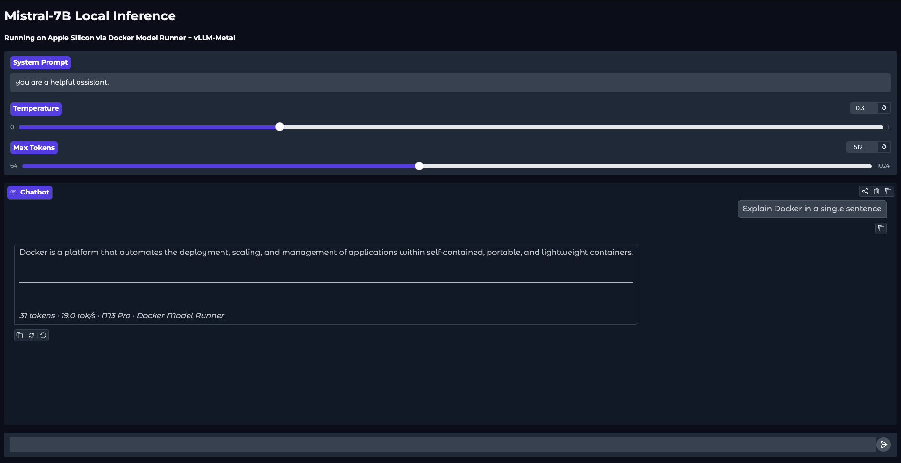

# Local LLM Stack using vLLM on Docker


Run **Mistral-7B** fully locally on Apple Silicon using Docker Desktop's built-in
Model Runner with **vLLM-Metal** GPU acceleration. No cloud. No API keys. No cost.

---

##  Why This is Exciting — vLLM-Metal on Apple Silicon

Until recently, running high-performance LLM inference locally on a Mac meant
accepting slow CPU-based generation or wrestling with fragile, unsupported tooling.
That changed with the arrival of **vLLM-Metal**.

[vLLM](https://github.com/vllm-project/vllm) is one of the fastest open-source
LLM inference engines available — built for throughput, low latency, and
OpenAI-compatible serving. Historically it was Linux/CUDA-only, designed for
data centre NVIDIA GPUs.

**vLLM-Metal** is the Apple Silicon port of vLLM, leveraging Apple's
**Metal Performance Shaders (MPS)** framework to run inference directly on the
unified GPU cores inside M-series chips. This is a significant milestone:

- **All M-series chips supported** — M1, M2, M3, M4 and their Pro/Max/Ultra variants
- **GPU-accelerated generation** — tokens are generated on Apple's GPU cores,
  not the CPU, yielding 20–40+ tok/s on Mistral-7B on an M3 Pro
- **Unified memory advantage** — Apple Silicon's unified memory architecture
  means the CPU and GPU share the same high-bandwidth memory pool, eliminating
  the memory copy overhead that slows down discrete GPU setups
- **Docker-native** — Docker Desktop's Model Runner ships vLLM-Metal as a
  first-class backend, meaning zero manual setup; pulling a model and serving
  it is a single command
- **OpenAI-compatible API** — the same REST interface as OpenAI's API,
  so any existing OpenAI SDK code works with a single `base_url` swap

This project demonstrates the full stack: Docker Model Runner pulls and serves
the model via vLLM-Metal, and a Python client + Gradio UI sit on top of the
OpenAI-compatible endpoint — all running entirely on your Mac.

---

## 🛠️ Prerequisites

- macOS with Apple Silicon (M1/M2/M3/M4)
- [Docker Desktop](https://www.docker.com/products/docker-desktop/) with **Model Runner enabled**
- Python 3.12+

---

## 🚀 Setup

### 1. Enable Docker Model Runner

In Docker Desktop → Settings → Features in Development → enable **Model Runner**, then:

```bash
docker desktop enable model-runner --tcp=12434
```

### 2. Pull Mistral-7B

```bash
docker model pull hf.co/bartowski/Mistral-7B-Instruct-v0.3-GGUF
docker model list   # confirm it's there
```

### 3. Clone & Install

```bash
git clone hhttps://github.com/sawan-devrani/local-llm-stack.git
cd local-llm-stack

python3 -m venv .venv
source .venv/bin/activate

pip install -r requirements.txt
```

---

## 💻 Usage

### Interactive CLI Chat

```bash
python client.py
```

Multi-turn conversation with token speed displayed after each reply.

**Example output on M3 Pro:**
```
Local Mistral-7B Chat (type 'quit' to exit)

You: Explain Docker in a single sentence

Assistant:
Docker is a platform that automates the deployment, scaling, and management of  
applications within self-contained, portable, and lightweight containers.       
── 31 tokens · 1.32s · 23.4 tok/s · M3 Pro
```

### Benchmark

```bash
python benchmark.py
```

Runs 5 diverse prompts and outputs a rich table of tokens, time, and tok/s.

**Example output on M3 Pro:**
```
Benchmark Results — M3 Pro (14 GPU cores)                  
┏━━━━━━━━━━━━━━━━━━━━━━━━━━━━━━━━━━━━━━━━━━━━━━━┳━━━━━━━━┳━━━━━━━━━━┳━━━━━━━┓
┃ Prompt                                        ┃ Tokens ┃ Time (s) ┃ tok/s ┃
┡━━━━━━━━━━━━━━━━━━━━━━━━━━━━━━━━━━━━━━━━━━━━━━━╇━━━━━━━━╇━━━━━━━━━━╇━━━━━━━┩
│ Explain Kubernetes in 3 bullet points....     │    164 │     8.30 │  19.8 │
│ Write a Python function to reverse a linked   │    256 │     8.80 │  29.1 │
│ list....                                      │        │          │       │
│ What are the pros and cons of microservices   │    256 │     8.80 │  29.1 │
│ archit...                                     │        │          │       │
│ Explain the difference between TCP and UDP in │    256 │     8.78 │  29.2 │
│ simp...                                       │        │          │       │
│ Summarize what a transformer model is in 2    │     88 │     3.08 │  28.6 │
│ sentenc...                                    │        │          │       │
└───────────────────────────────────────────────┴────────┴──────────┴───────┘

Average: 27.0 tok/s across 5 prompts
Total: 1020 tokens in 37.75s
```

### Gradio Web UI

```bash
python app_ui.py
# Open http://127.0.0.1:7860
```

Adjust system prompt, temperature, and max tokens live in the browser.

---
**Example output screenshot**



**Perform a dry run test using Curl**

```
sawandevrani@Sawan-Mac ~ curl http://localhost:12434/v1/models | python3 -m json.tool
  % Total    % Received % Xferd  Average Speed   Time    Time     Time  Current
                                 Dload  Upload   Total   Spent    Left  Speed
100   156  100   156    0     0  35936      0 --:--:-- --:--:-- --:--:-- 39000
{
    "object": "list",
    "data": [
        {
            "id": "huggingface.co/bartowski/mistral-7b-instruct-v0.3-gguf:latest",
            "object": "model",
            "created": 1716404981,
            "owned_by": "docker"
        }
    ]
}
sawandevrani@Sawan-Mac ~ % curl http://localhost:12434/v1/chat/completions \
  -H "Content-Type: application/json" \
  -d '{
    "model": "hf.co/bartowski/Mistral-7B-Instruct-v0.3-GGUF",
    "messages": [
      {"role": "user", "content": "What is Kubernetes in one sentence?"}
    ],
    "max_tokens": 100
  }' | python3 -m json.tool

  % Total    % Received % Xferd  Average Speed   Time    Time     Time  Current
                                 Dload  Upload   Total   Spent    Left  Speed
100   898  100   711  100   187    193     50  0:00:03  0:00:03 --:--:--   244
{
    "choices": [
        {
            "finish_reason": "stop",
            "index": 0,
            "message": {
                "role": "assistant",
                "content": " Kubernetes is an open-source container orchestration system for automating the deployment, scaling, and management of containerized applications."
            }
        }
    ],
    "created": 1772392045,
    "model": "model.gguf",
    "system_fingerprint": "b1-c55bce4",
    "object": "chat.completion",
    "usage": {
        "completion_tokens": 28,
        "prompt_tokens": 13,
        "total_tokens": 41
    },
    "id": "chatcmpl-nYMU7GoA9zGE7ql9qm5eTviaYIBRHJgi",
    "timings": {
        "cache_n": 0,
        "prompt_n": 13,
        "prompt_ms": 211.079,
        "prompt_per_token_ms": 16.236846153846155,
        "prompt_per_second": 61.58831527532346,
        "predicted_n": 28,
        "predicted_ms": 907.144,
        "predicted_per_token_ms": 32.398,
        "predicted_per_second": 30.866102845854684
    }
}


```


## Architecture

```
Browser / CLI
     │
     ▼
Gradio UI / Python Client (OpenAI SDK)
     │  HTTP  (port 7860 / stdin)
     ▼
Docker Model Runner  ←→  OpenAI-compatible REST API (port 12434)
     │
     ▼
vLLM-Metal (Apple GPU cores)
     │
     ▼
Mistral-7B-Instruct-v0.3-GGUF
```

---

## Configuration

All three scripts share the same model endpoint. To change the model, update the
`MODEL` constant at the top of each file:

```python
MODEL = "hf.co/bartowski/Mistral-7B-Instruct-v0.3-GGUF"
BASE_URL = "http://localhost:12434/v1"
```

---